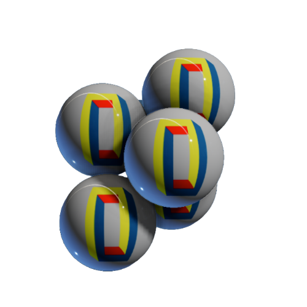

  

<div  id="readme-top"  align="center">

<!-- LINK -->

<a  href="https://www.oreyusuf.co.uk/project/clumping-balls">

</img>

</a>

<h1  align="center"> Clumping Balls </h1>

<h3> A Three.js Demo of Interactive Physics and Convergence </h3>

<br />

[<kbd> <br> View Demo → <br> </kbd>][Codesandbox-url]

<br />

<p  align="center"  style="color:#8080802e">

Why did the balls love this clumping demo?

<br />

</p>

  

<details  style="color:#8080802e">

<summary>Answer</summary>

<br />

Because they could finally stick together with no strings attached!

<br />

<br />

(😅)

</details>

  

</div>

<br />

<div  align="center">

  

<br/>

<!-- ABOUT THE PROJECT -->
<h2  align="center"> About The Project </h2>
  
  


  

<br/>

<br/>

  
  

`Clumping Balls` is a fun interactive demo made with Three.js. It lets you play around with balls that stick together and come to rest naturally to find their own stable positions.

  

<i>... featuring interactive physics and local minima convergence. The dynamic spheres are driven by a constant gravitational force and user input, converging towards a local minima.</i>

  
  

### Built With

  

[![React][React.js]][React-url] </span> [![Threejs][three.js]][three-url]

  

<br/>

  

<p  align="right">(<a  href="#readme-top">back to top</a>)</p>

  

<br/>

  
  

<!-- GETTING STARTED -->

## Getting Started

  

Instructions on setting up project to get a running follow these simple these steps.

  

### Installation

  

<div  align="left">

  

<!-- LINK! -->

1. Clone the repo

```sh

git clone https://github.com/github_username/repo_name.git

```

2. Install NPM packages

```sh

npm install

```

3. Run the app

```sh

npm run start

```

Runs the app in the development mode.

Open [http://localhost:3000](http://localhost:3000) to view it in your browser.

  
  

<div>

  

<p  align="right">(<a  href="#readme-top">back to top</a>)</p>

  
  

<!-- CONTACT -->

## Contact

<div  align="left">

  

[![Website][meWebsite]][meWebsite-url]

  

[![React][React.js]][React-url]

  

[![Github][Github]][Github-url]

  

[![LinkedIN][Linkedin]][linkedin-url]

  

[![Codesanbox][Codesandbox]][Codesandbox-url]

  

</div>

  

<p  align="right">(<a  href="#readme-top">back to top</a>)</p>

  
  

</div>

  

[React.js]: https://img.shields.io/badge/React-20232A?style=for-the-badge&logo=react&logoColor=61DAFB

[React-url]: https://reactjs.org/

  

[three.js]:https://img.shields.io/badge/Three.js-000000?style=for-the-badge&logo=three.js&logoColor=white

[three-url]:https://threejs.org/

  
  

[meWebsite]: https://img.shields.io/badge/website-000000?style=for-the-badge&logo=About.me1&logoColor=white

[meWebsite-url]: https://oreyusuf.co.uk

  
  

[github]: https://img.shields.io/badge/GitHub-100000?style=for-the-badge&logo=github&logoColor=white

[github-url]: https://github.com/OreYusuf

  
  

[linkedin]: https://img.shields.io/badge/LinkedIn-0077B5?style=for-the-badge&logo=linkedin&logoColor=white

[linkedin-url]: https://www.linkedin.com/in/ore-yusuf/

  

[Codesandbox]: https://img.shields.io/badge/Codesandbox-000000?style=for-the-badge&logo=CodeSandbox&logoColor=white

[Codesandbox-url]: https://example.com